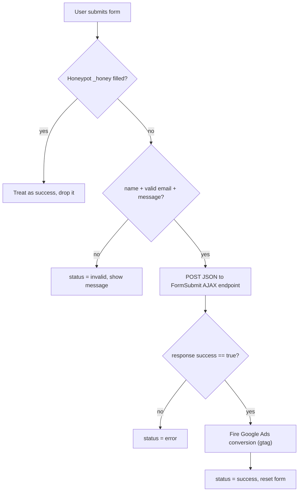

# Architecture

Technical overview of the GestPrime website. For setup and editing instructions see
[README.md](README.md).

## 1. Overview

GestPrime is a **single-page marketing website**: one HTML document, all content rendered
by React on the client. It is intentionally lightweight and dependency-light:

- **No router.** Navigation is anchor-based (`#sobre`, `#servicos`, ...) with smooth scroll
  and a scroll spy. There is only one page.
- **No CSS framework.** One hand-written [`src/styles.css`](src/styles.css) with CSS custom
  properties for theming (navy + gold).
- **No state-management library.** Local component state plus a single React context for
  language (i18n).
- **No backend.** The site is fully static. Email delivery, analytics and maps are handled
  by third-party services loaded from the client.

This keeps the bundle small, the build fast, and hosting free on GitHub Pages.

## 2. Tech stack

| Concern        | Choice                                                    |
| -------------- | --------------------------------------------------------- |
| UI library     | React 18                                                  |
| Build tool     | Vite 6                                                    |
| Language       | JavaScript (JSX), ES modules                              |
| Styling        | Plain CSS with custom properties (single stylesheet)      |
| i18n           | Custom React context (no library), PT/EN                  |
| Fonts          | Google Fonts: Cormorant Garamond (headings), Manrope (UI) |
| Form delivery  | FormSubmit (AJAX, no backend)                             |
| Analytics/Ads  | Google tag (gtag.js) + manual conversion                  |
| Map            | Google Maps embed (iframe)                                |
| Hosting        | GitHub Pages, custom domain via CNAME                     |
| CI/CD          | GitHub Actions (build + deploy on push to `main`)         |

## 3. Component tree

```
main.jsx
└─ <LanguageProvider>            i18n context (lang, t, toggle)
   └─ <App>                      composition + global effects
      ├─ <Preloader>             loading overlay (self-removing)
      ├─ <Navbar>                fixed bar, scroll spy, language switch, mobile menu
      ├─ <main>
      │  ├─ <Hero>               #top
      │  ├─ <Platforms>
      │  ├─ <About>              #sobre
      │  ├─ <Services>           #servicos
      │  ├─ <Process>            #processo
      │  ├─ <Features>
      │  ├─ <Faq>                #faq
      │  ├─ <CTA>
      │  └─ <Contact>            #contacto  (form + FormSubmit + map)
      ├─ <Footer>                legal links (open LegalModal)
      ├─ <CookieBanner>
      ├─ <FloatingButtons>       WhatsApp + back-to-top
      └─ <LegalModal>            Privacy / Terms (state lifted to App)
```

Every section component is presentational: it reads its copy from the i18n context and
renders. The only components holding state are `App` (legal modal, effects), `Navbar`
(scroll/menu state), `Contact` (form status), `Faq` (open item) and `CookieBanner`.

## 4. Bootstrapping and composition

**[`src/main.jsx`](src/main.jsx)**

1. Adds a `js` class to `<html>`. The reveal animations only hide content when this class
   is present, so if the script fails to load the content stays fully visible (no blank page).
2. Wraps `<App>` in `<LanguageProvider>` and mounts to `#root`.

**[`src/App.jsx`](src/App.jsx)** owns three things beyond composition:

- `legal` state (`'privacy' | 'terms' | null`) passed down to `Footer` (to open) and
  `LegalModal` (to render).
- **Scroll to top on load** (`useLayoutEffect`): sets `history.scrollRestoration = 'manual'`
  and `scrollTo(0, 0)`, so a reload always starts at the hero instead of mid-page.
- **Reveal on scroll** (`useEffect`, keyed on `lang`), described below.

## 5. Content and i18n

**Single source of truth: [`src/data/content.js`](src/data/content.js)**

- `content` is an object keyed by language (`pt`, `en`); each holds the full nested copy for
  every section.
- `CONTACT` holds language-independent shared data: `phones`, `phonePrimaryE164`, `email`,
  `instagram`, `mapsQuery`, and `adsConversionSendTo` (Google Ads).

**[`src/i18n.jsx`](src/i18n.jsx)**

- `LanguageProvider` resolves the initial language via `localStorage` -> `navigator.language`
  -> `pt`, persists the choice to `localStorage`, and keeps `document.documentElement.lang`
  in sync.
- Exposes `{ lang, setLang, toggle, t }` through `useLang()`, where `t` is
  `content[lang]`. Components read copy as `t.hero.title`, etc.

Switching language just changes the context value, which re-renders every consumer with the
other language's strings. No page reload, no data fetching.

## 6. Styling and theming

[`src/styles.css`](src/styles.css) is organised as: CSS variables (`:root`) -> base elements
-> shared utilities (buttons, section headers) -> per-section blocks -> reveal animation ->
responsive overrides.

- **Theme** is driven by custom properties (`--navy`, `--gold`, `--gold-bright`, spacing,
  shadows, easing). Changing the palette is a one-place edit.
- **Responsive breakpoints:** `980px` (tablet: stacked hero, 2-col grids, hamburger menu),
  `720px` (phone: single column), plus smaller tweaks (e.g. `560px` footer).
- `overflow-x: clip` on the root contains the off-canvas mobile menu so it never creates a
  horizontal scrollbar.

## 7. Key behaviors and design decisions

These are the non-obvious engineering choices worth knowing before changing the code.

### Reveal on scroll (scroll-position based, not IntersectionObserver)
Sections start hidden (`.js .reveal { opacity: 0 }`) and get `is-visible` when their top
enters the viewport. It is driven by scroll position (`getBoundingClientRect().top < 0.9 *
innerHeight`), **not** an IntersectionObserver, because an observer never fires for sections
the user skips over (anchor links, fast scrolling, reload at a scrolled position), leaving
them permanently blank. The effect also:

- re-runs on **language change** (keyed on `lang`), because switching language can remount
  elements that would otherwise lose their revealed state;
- has a `load` listener as a safety net for late layout shifts (fonts/images);
- is gated behind the `.js` class so missing JS never hides content.

### Language-independent React keys
List items (service cards, feature blocks) use language-independent `key`s (icon name, index)
rather than the translated text. Otherwise, switching language changes the keys, React
remounts the elements, and they lose their imperatively-added `is-visible` class and vanish.

### Navbar scroll spy
The active nav link is the last section whose top has crossed a threshold, computed with
`getBoundingClientRect()` (live viewport position). This is robust to layout shifts from
lazy-loaded images, unlike cached `offsetTop` values.

### Mobile menu (full-screen off-canvas)
- The menu is a `position: fixed` full-screen overlay that slides in.
- The navbar must **not** use `backdrop-filter` on mobile: a filtered ancestor becomes the
  containing block for `position: fixed` descendants, which would size the menu to the navbar
  instead of the viewport. On mobile the solid navbar uses an opaque background instead.
- While open, `App`/`Navbar` lock body scroll and add a `menu-open` class that hides the
  floating buttons; `Esc` and the backdrop close it.
- The top bar (logo, PT/EN, close X) is forced to its light appearance while open so it stays
  legible over the navy panel, and is raised above the panel via `z-index`.

### Logo cross-fade
Two logo images (light and dark) are always in the DOM and cross-fade by opacity as the
navbar turns solid, instead of swapping one image's `src` (which flickers and can flash while
the new image loads).

### Scroll restoration
Browser scroll restoration is disabled (`manual`) and the page is forced to the top on load,
which is the desired behavior for this single-page site.

## 8. Contact form flow

The form ([`src/components/Contact.jsx`](src/components/Contact.jsx)) never navigates; it
submits via `fetch` and updates local `status` state (`idle | sending | success | invalid |
error`).



Notes:

- **Validation** runs client-side before sending (required fields + email regex).
- **Spam:** a hidden `_honey` honeypot field; if filled, the submit is silently dropped.
- **Delivery:** FormSubmit's AJAX endpoint returns JSON, so the page never reloads. FormSubmit
  requires a one-time **per-domain** activation (see README).
- **Conversion:** on success, a Google Ads conversion is fired manually (see below), because
  the AJAX submit prevents Google's automatic form detection from counting it.

## 9. Analytics and conversions

- The base **Google tag** (`gtag.js`, `AW-18280831262`) is loaded in the `<head>` of
  [`index.html`](index.html), so it is present on every load.
- A form submission is a **manual conversion**: `Contact.jsx` calls
  `gtag('event', 'conversion', { send_to: CONTACT.adsConversionSendTo })` on success, guarded
  so it is inert until `adsConversionSendTo` is set to `AW-18280831262/<LABEL>`.

## 10. Build and deployment

- `npm run build` (Vite) outputs a static bundle to `dist/`: hashed JS/CSS, the processed
  `index.html`, and everything from `public/` copied verbatim (logos, images, favicon, and
  `CNAME`).
- `vite.config.js` sets `base: '/'` (correct for a root custom domain).
- **CI/CD:** [`.github/workflows/deploy.yml`](.github/workflows/deploy.yml) runs on push to
  `main`: `npm ci` -> `npm run build` -> upload the `dist` artifact -> deploy to GitHub Pages.
- The custom domain is configured by [`public/CNAME`](public/CNAME) plus DNS records (see README).

```
push to main
   -> GitHub Actions: npm ci -> npm run build -> upload dist
   -> deploy-pages -> https://gestprime.online
```

## 11. Extending the site

To add a new section:

1. Add its copy under both `pt` and `en` in [`src/data/content.js`](src/data/content.js).
2. Create a component in `src/components/` that reads from `useLang().t` and renders a
   `<section>` (add `id` if it needs an anchor, and `reveal` on elements that should animate in).
3. Import and place it in [`src/App.jsx`](src/App.jsx).
4. If it should appear in the navbar/scroll spy, add its `id` to the `links` array in
   [`src/components/Navbar.jsx`](src/components/Navbar.jsx).
5. Style it in [`src/styles.css`](src/styles.css) using the existing theme variables.
